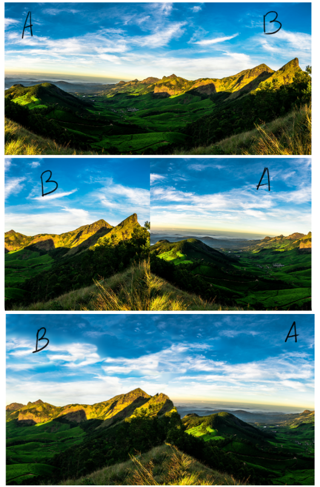
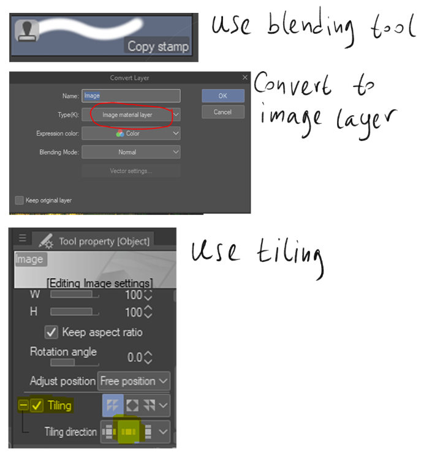
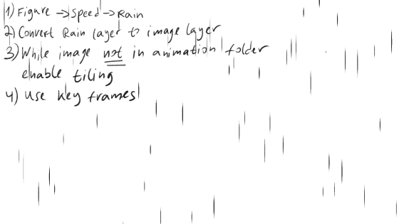
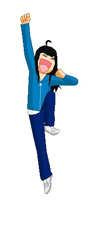
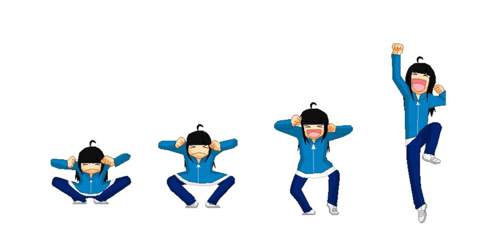

# Animations

## Resources
[Telepurte  youtube chanel](https://www.youtube.com/channel/UCkDtCKtPKlsg-gJO_m5D0mQ)

## King's Tips
* Use `vector layers` for animation cells! This allows copy content from cell to cell.

# Theory

## Tutorials

### Infinite Backgrounds

### Rain

### Walking
[Walking cycle puppet animation guide](https://www.youtube.com/watch?v=66go82rZW4g&t=974s)  

### Jumping

