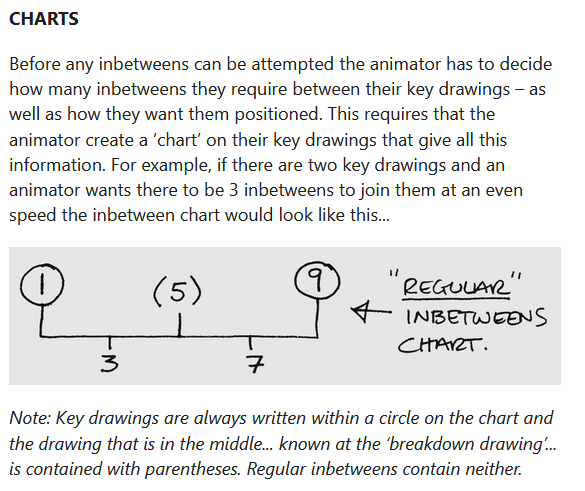
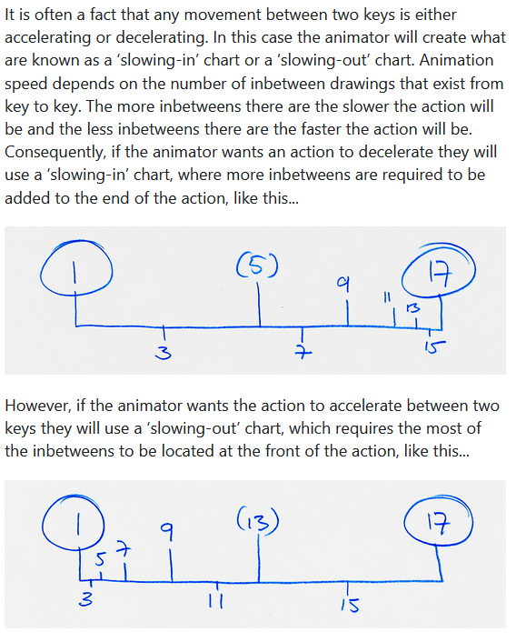

# Animations

## Resources
[Telepurte  youtube chanel](https://www.youtube.com/channel/UCkDtCKtPKlsg-gJO_m5D0mQ)

# Theory

## Tutorials

### Walking
[Walking cycle puppet animation guide](https://www.youtube.com/watch?v=66go82rZW4g&t=974s)  
