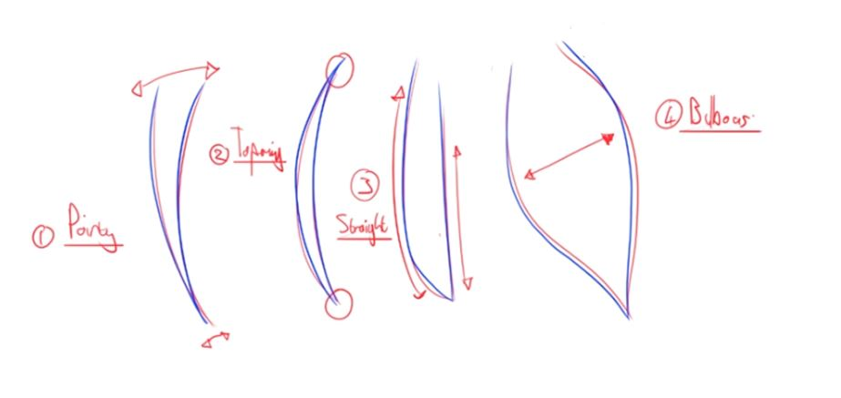

# Character Design

## Faces

### Head

### Eyes

### Ears

### Nose

## Hair

### Important points when drawing hair

* Hair should be loose and flow.
* Hair should have clear direction of flow.
* Hair should have volume (Dry hair has more volume than wet).
* Hair should be created from masses and shapes.

Example of `Rough` and `Refined` hair drawing stages:

### Main hair types

There are few main hair structures that we can use:

### Examples

