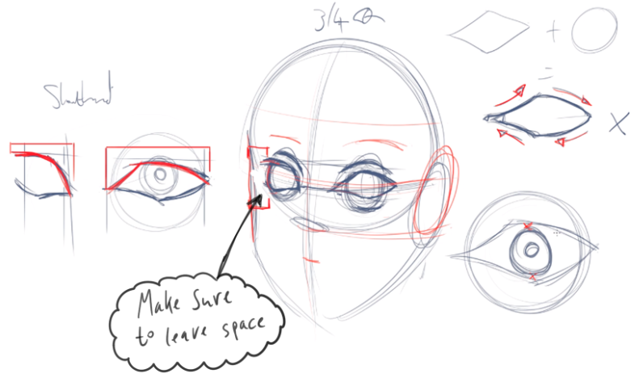

# Character Design

[Clothing](Clothing/README.md)  
[Facial Expressions](Facial_Expressions/README.md)  

## Faces

### Head

### Eyes

[Drawing eyes tutorial](https://medibangpaint.com/en/use/2016/03/how-to-draw-eyes-in-medibang-paint/)

### Ears

### Nose

### Lips
[Tutorial video](https://www.youtube.com/watch?v=pB5fyDLJGhE)

#### Front view

#### 3/4 view

## Hair

### Tutorials
[Drawing hair tutorial](https://www.youtube.com/watch?v=hgxvWvT4B7A)  
[Drawing hair tutorial by Angel Ganev](https://www.youtube.com/watch?v=ClAMuGEfFNM)  

### Important points when drawing hair
* Hair should be loose and flow.
* Hair should have clear direction of flow.
* Hair should have volume (Dry hair has more volume than wet).
* Hair should be created from masses and shapes.

Example of `Rough` and `Refined` hair drawing stages:

### Main hair types

There are few main hair structures that we can use:

### Examples

