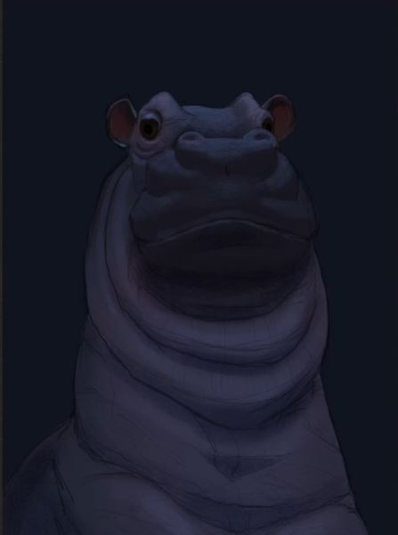
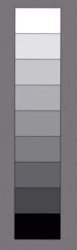
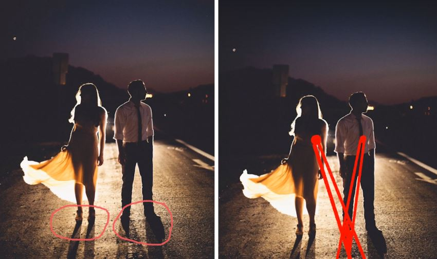

# Coloring

## Practical Techniques

### Using color layers

### Drawing Cast Shadows

1. Create shadows layer over the flat colors layer.  
2. Set shadows layer mode to `Multiply`.  
3. Select shadows color (Blue, Yellow or other).  
4. Draw shadows.

### Light Bloom
Light bloom effect occurs when the light source  
is behind the drawn object. 

1. Select the drawn object.
2. Create layer of background without the object.    
3. Apply blur on the background.

### Drawing Lighting

Consider using chalk for skin shadows.  
Chalk texture looks like skin.  

#### Sun light

1. Start with base color.  
2. First shadows layer.  
   Layer blend type is multiply.  
   Layer color is light blue (Very light!).  
3. Add first light layer.  
   Layer opacity should be low! Like 25%.  
   The color is light yellow.  
4. Second shadows layer.  
   Those are the darkest shadows. 
5. Second light layer.  
   Stronger light.  
6. Create layer of extra light.  
   Set layer blent to overlay.    
   Draw warm orange for the light.  
   Draw deep blue for that shadows.  
7. Set the extra light layer opacity to low value.  

#### Moon light

* Start with base colors.  
* Create blue color layer to make the image in night.  
  Set the layer blending to multiply.  
* Draw the moon light in cold blue.  
  Shadows layer is in multiply mode.  
  Opacity is in 100%. Play with color not opacity.    

## Theory

### Basics
Color zones on an object:  

Value scale with 9 levels:   

### Shadows

#### Strong light source
If the light source us strong, the shadow has crisp edges and no blur.  

#### Soft light source
If the light source us less strong and not direct, the shadow will be soft and have blur on edges.  

#### Long shadows
Shadows are crisp near the object casting them.  
They are becoming more blurry as they are getting far from the object.  

#### Multiple light sources
If there are multiple light sources, the places
where the shadows from those sources meet will be  darker.    
