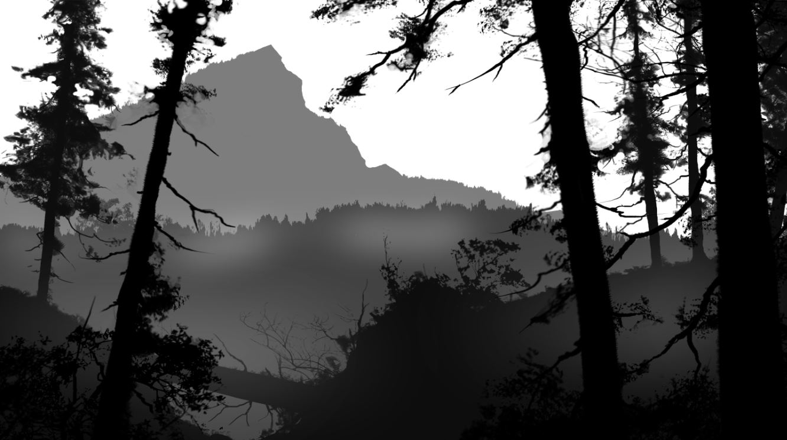
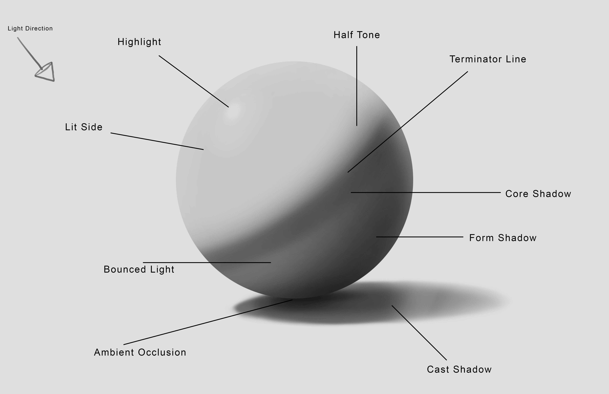
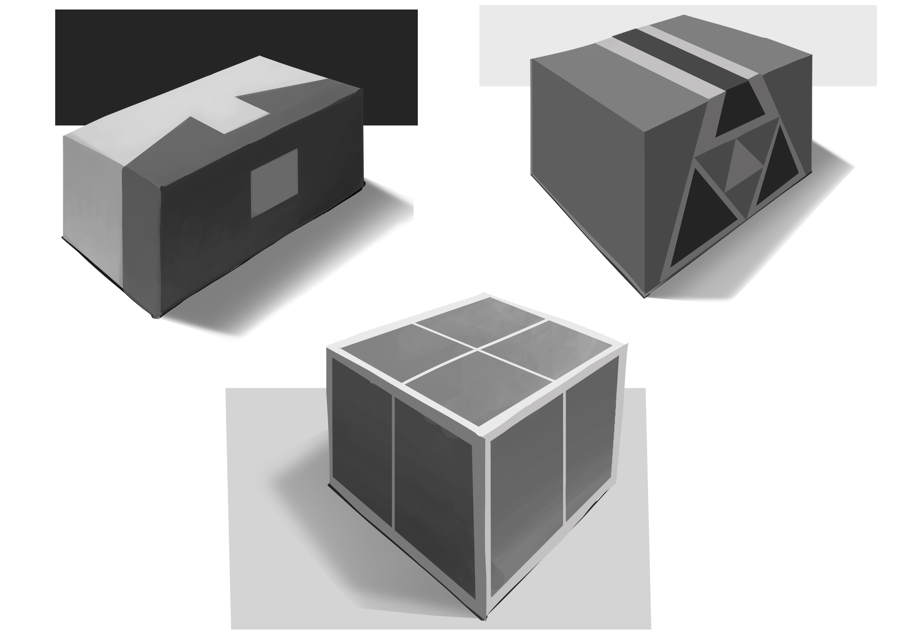
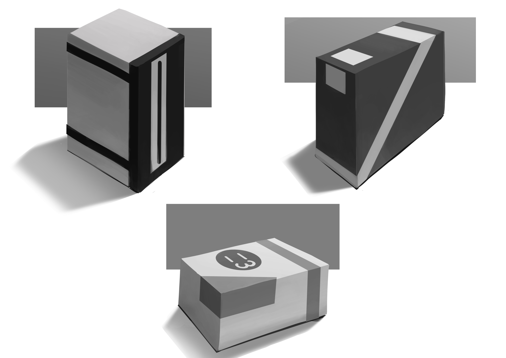
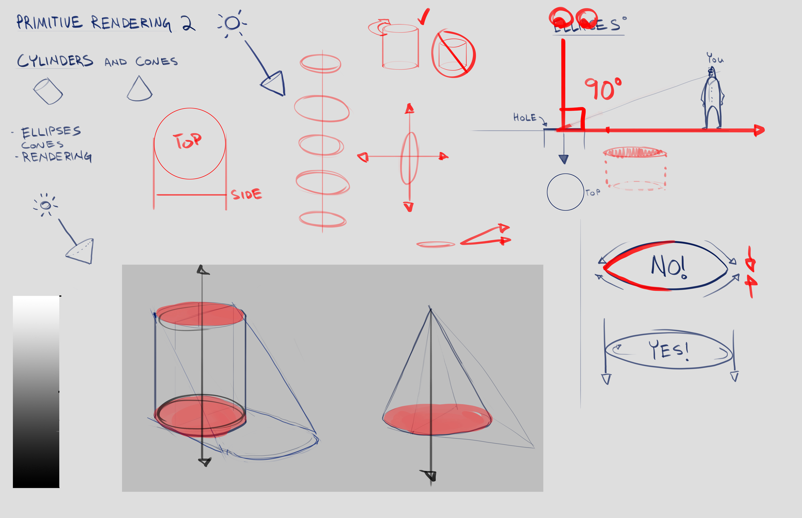
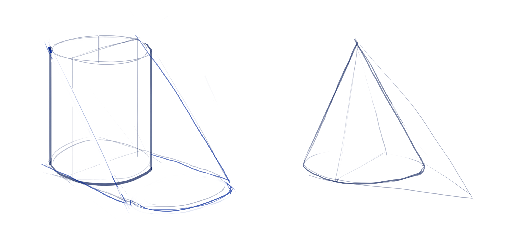
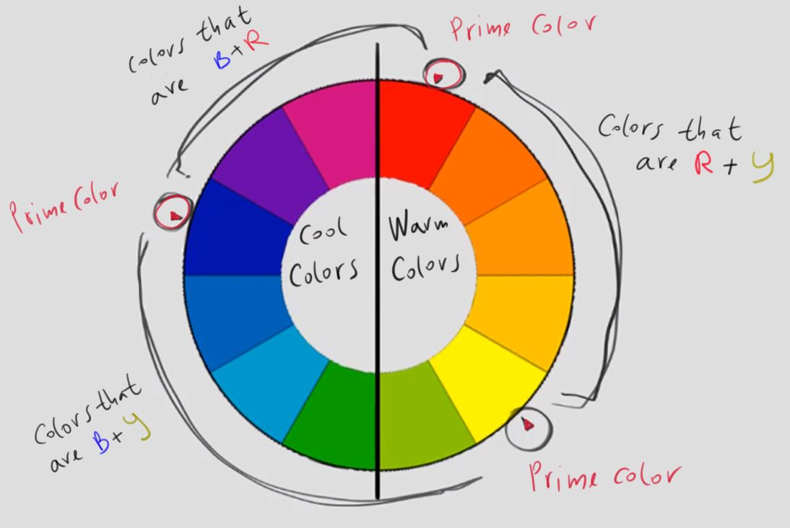
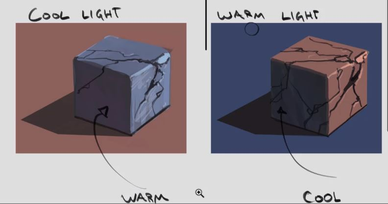
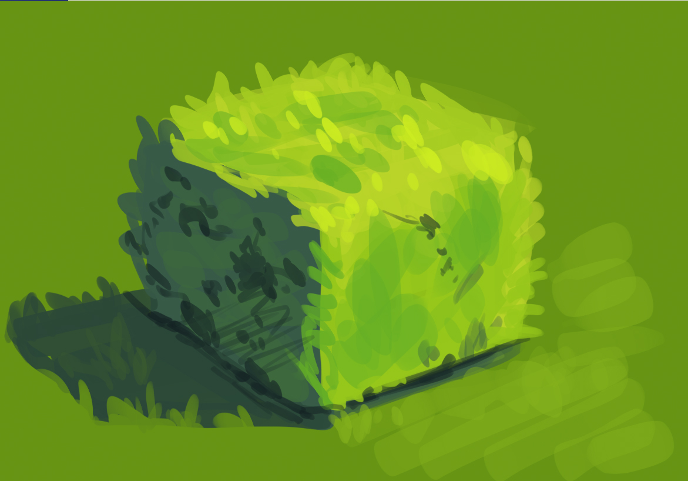
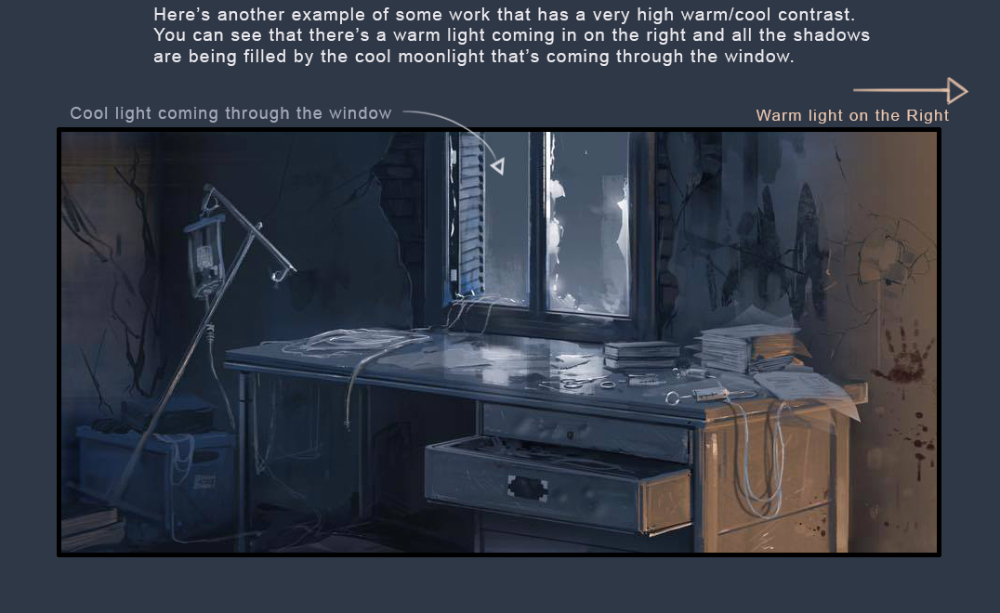

# Environment Design

## Line Wight

There are 3 main line types:  

Thumb rule for line usage:  
`Thin` lines are lines that are not visible.  
`Gray` lines are lines for edges that the ant can goes over, and remain visible.  
`Black` lines are for edges that if the ant goes over them, it will be not visible.  

## Perspective

The most common `vanishing points` configuration is using two vanishing points.  
To find the `horizon line`, look for horizontal objects in the scene.  
Here are some examples of scenes with two vanishing points:  

### Perspective grid 
`Perspective grid` can be used to simplify the drawing.  

How perspective grid is created:  

Here is an example of perspective grid usage:  

## Atmospheric Perspective
Far objects have less sharp color from those who are close.
In the following example, all layers are black.  
Go to  `Edit` -> `Tonal Correction` -> `Level Correction` and set  
brighter level to the far layers.  
Adding `Mist Layers` between the original layers can make the image more realistic.   

## Lighting

## Rendering
`Half To Black` is technique to find the correct values of shadows.  
`Ambient Occlusion Shadows` are shadows on form ends.  

### Spheres and Cubes

Few examples:

### Cylinders and Cones

Examples:

## Colors
`Prime Color` is color that is not a combination of other colors.  

`Complimentary Colors` are colors that oppose each other on the color wheel.  
For example: Green and Red are complimentary colors.  

### Light Shadow Contrast 
`Light Shadow Contrast` is achieved in two ways:  
1. Cool light + warm shadow.  
2. Warm light + cool shadow.  

This contrast is making the painting more alive and colorful.  

#### Bush example  
This example is good demonstration of light/shadow contrast.   
The light is warm yellow.  
The shadow is cool blue.  

#### More Examples

