# Enviroment Design

## Line Wight

There are 3 main line types:  

Thumb rule for line usage:  
`Thin` lines are lines that are not visible.  
`Gray` lines are lines for edges that the ant can goes over, and remain visible.  
`Black` lines are for edges that if the ant goes over them, it will be not visible.  

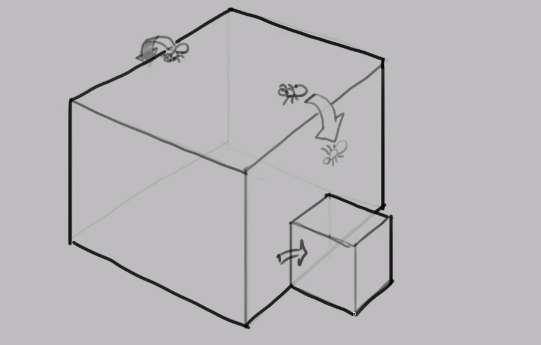

## Prespective
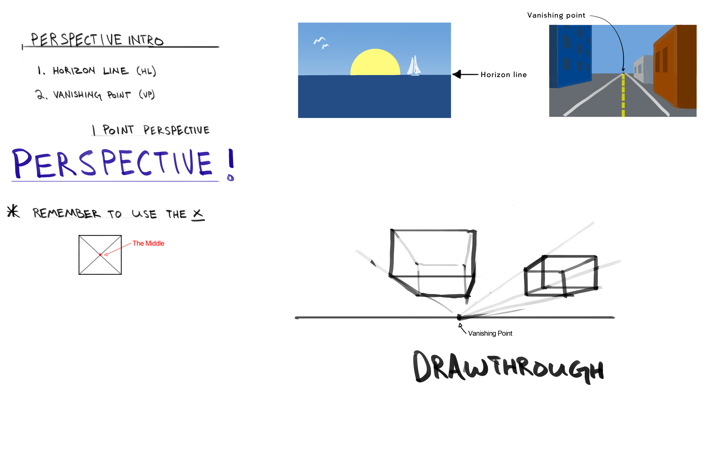

The most common `vanishing points` configuration is using two vanishing points.  
To find the `horizon line`, look for horisontal objects in the scene.  
Here are some examples of scenes with two vanishing points:  
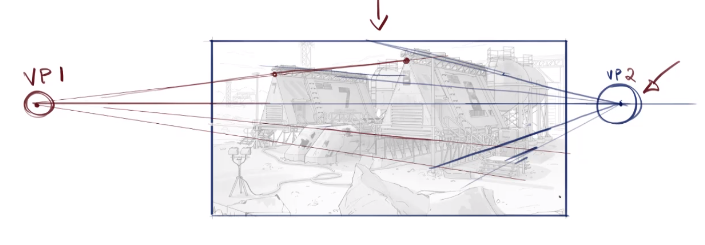
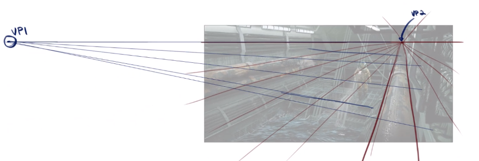

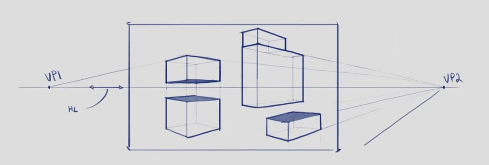

### Perspective grid 
`Perspective grid` can be used to simplify the drawing.  

How perspective grid is created:  
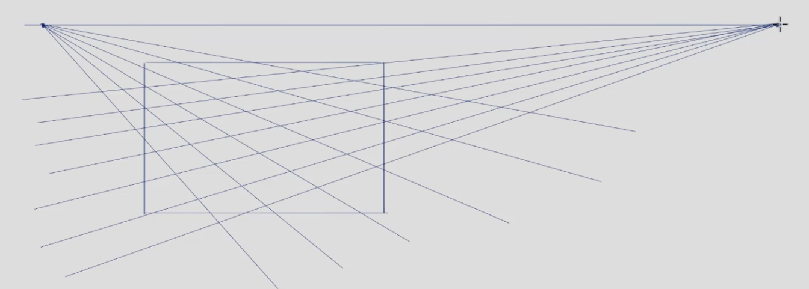

Here is an example of perspective grid usage:  
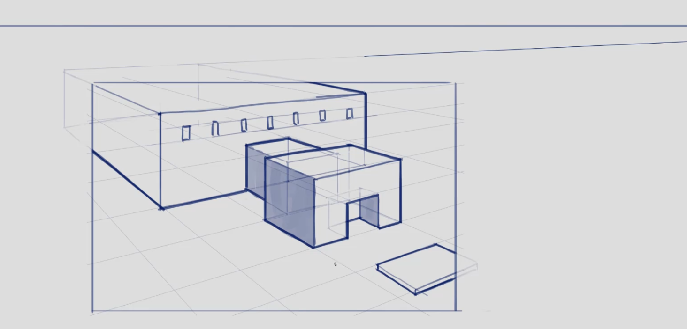

### Perspective multiplying
You can create plains on perspective from already existing plain.  
In the following example, plain A has the same size as plain B:  
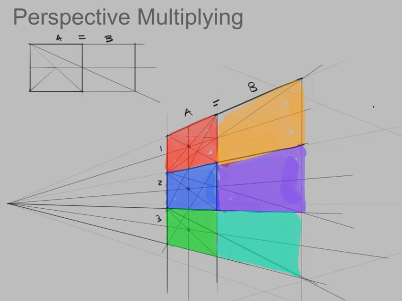

### Perspective dividing
You can divide perspective plains to smaller plains:  
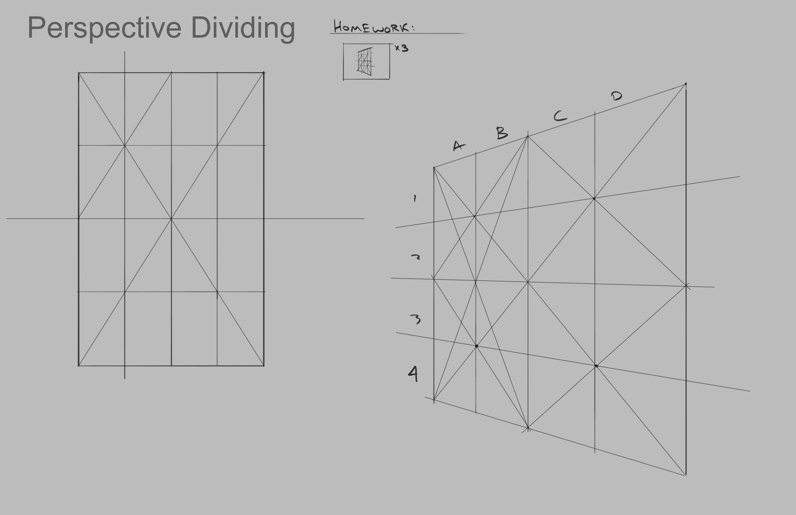

## Lighting

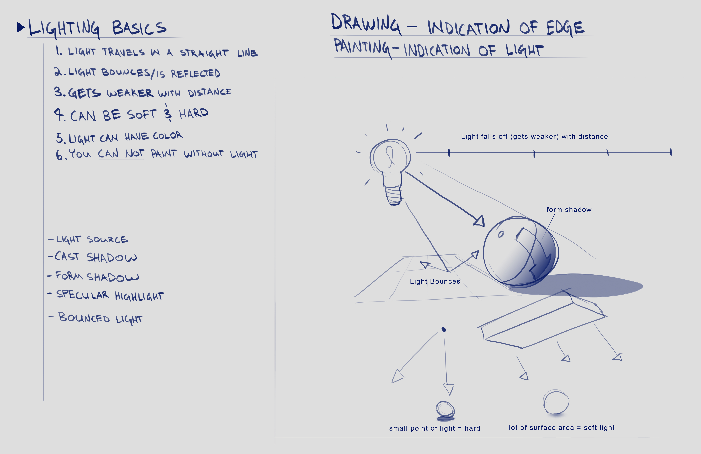

## Rendering

`Half To Black` is technique to find the correct values of shadows.  
`Ambient Occlusion Shadows` are shadows on form ends.  

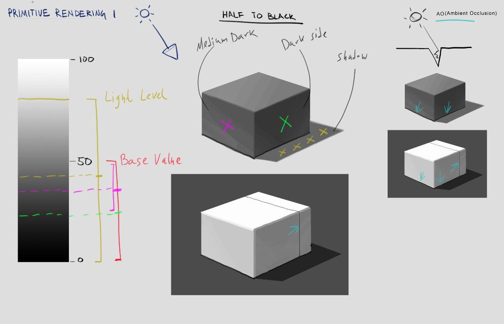
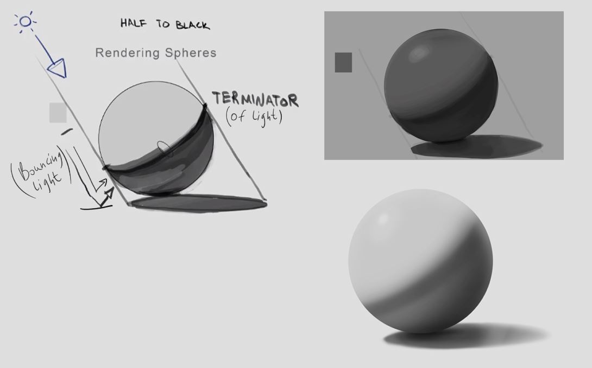

